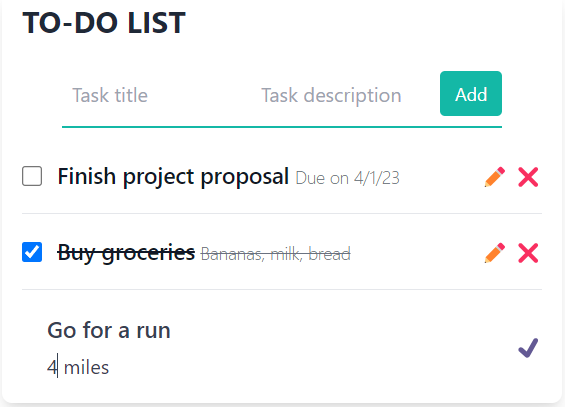

# Go + HTMX To-Do List
A modest todo list app built with Go, HTMX and Tailwind CSS. The primary objective behind creating this app was to explore the capabilities of HTMX and gain insights into its practical implementation.



# What it can currently do

- Create, Read, Update and Delete tasks
- Complete tasks
- Data is stored in PostgreSQL

# Dependencies
- go 1.19
- make
- tailwind (standalone cli)
- air (live-reloading)
- docker

# Implementation details

Most of the code in Go is a HTTP server to handle the requests made from the HTMX library. Those requests, if successful, will execute a template (template/html package) and respond with a HTML document. 

HTMX can use those HTML reponses to dinamically swap parts of the page without the need of reloading the whole page (like a traditional form submit would do). This enables the app to have interactivity similar to many popular JS Frameworks/Libraries but without the need to actually write (as much) JavaScript.

The page styling is handled by the Tailwind CSS Standalone CLI, it will process the .hmtl files at ./templates a generate a resulting CSS file at ./dist/output.css that is served by the Go server.

Storage is handled by PostgreSQL running in a container.

# How to run

## Server
Serves the HTMX app.

In a browser visit  ***http://localhost:8080***

### Without Docker

 - Download the [Tailwind CSS Standalone CLI](https://tailwindcss.com/blog/standalone-cli) and setup in your PATH as **tailwind**
 - Setup a PosgreSQL server: The connection string is passed as a ENV variable named **PG_CONN_STR**, ENV variables are defined in the [.env](./.env), look it up for reference

Then run the Make file:

```$ make run_l```

### Docker Compose

#### Source on host machine with live-reload, database on Docker

```$ make run```

#### Everithing on Docker

```$ docker compose up```

## Populator
    
Inserts the contents of [population.json](./population.json) file into the database

### Without Docker

 - Setup a PosgreSQL server: The connection string is passed as a ENV variable named **PG_CONN_STR**, ENV variables are defined in the [.env](./.env), look it up for reference

 Then run the Make file:

```$ make populate_l```


### Docker Compose

```$ make populate```
