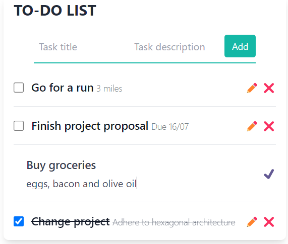

# Go + HTMX To-Do List
A modest todo list app built with Go, HTMX and Tailwind CSS. The primary objective behind creating this app was to explore the capabilities of HTMX and gain insights into its practical implementation.



# What it can currently do

- Create and Read tasks
- Complete tasks
- Data is stored in memory

# Dependencies
- go 1.19
- make
- tailwind (standalone cli)
- air (live-reloading)

# Implementation details

Most of the code in Go is a TCP server to handle the HTTP requests made from the HTMX library. Those requests, if successful, will execute a template (template/html package) and respond with a HTML document. 

HTMX can use those HTML reponses to dinamically swap parts of the page without the need of reloading the whole page (like a traditional form submit would do). This enables the app to have interactivity similar to JavaScript Frameworks/Libraries but without the need to actually write (as much) JavaScript.

The page styling is handled by the Tailwind CSS Standalone CLI, it will process the .hmtl files at ./templates a generate a resulting CSS file at ./dist/output.css that is also served by the Go server.

# How to run

```$ make run```

In a browser visit  http://localhost:8080 